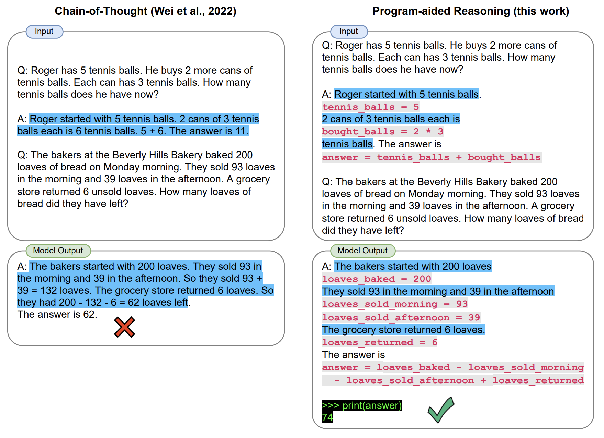

# PAL (experiment)
This repository contains the code used to test the PAL technique as a potential solution for our problem statement. 


### Usage of this repository - 

From the pal directory run setup.py to install PAL.

Install the necessary libraries - 

`pip install -r requirements.txt`

Run the PAL_trial_1.ipynb file for results. 


# Methodology of the technique - 



PAL is an approach that combines the power of large language models (LLMs) with programmatic reasoning to solve complex tasks. 

### 1. Natural Language Understanding:

The process starts with the LLM reading and understanding the natural language description of the task. This involves parsing the text, identifying key concepts and relationships, and extracting relevant information.

### 2. Program Generation:

Based on the understanding of the task, the LLM generates a series of interleaved natural language (NL) and programming language (PL) statements. These statements represent the reasoning steps and algorithms needed to solve the problem.

### 3. Program Execution:

The generated program is then passed to a runtime environment, such as a Python interpreter, for execution. This environment executes the program step-by-step, performing the required calculations and operations. In the context of the problem statement, the execution function does nothing as we require just the generated JSON schema.

### 4. Solution Output:

After program execution, the results are retrieved and translated back into natural language. This provides the final solution to the original task in a format that is understandable by the user.


#### Key Differences from Chain-of-Thought (CoT) Prompting:

PAL differs from CoT prompting in several key aspects:

- Intermediate Representation: PAL uses a combination of NL and PL statements to represent the reasoning steps, while CoT 
  relies solely on NL prompts.
- Solution Computation: PAL offloads the solution computation to a dedicated runtime, whereas CoT attempts to solve the 
  entire problem within the LLM itself.
- Transparency: PAL's programmatic representation allows for easier debugging and analysis of the reasoning process, which 
  can be difficult with CoT's black-box nature.


#### Benefits of PAL:

- Improved Reasoning: PAL can handle tasks that require complex reasoning and logic, which can be challenging for 
  traditional LLMs.
- Increased Efficiency: By offloading computation to the runtime, PAL can solve tasks faster and with less memory usage.
- Enhanced Accuracy: The combination of LLM and programmatic reasoning can lead to more accurate and reliable solutions.
- Better Explainability: The explicit program representation provides a clear explanation of the reasoning process used to 
  solve the task.
  
Overall, PAL offers a promising approach for tackling complex NLP tasks by leveraging the strengths of both LLMs and programmatic reasoning.

# Analysis -

The combination of LLM and programmatic reasoning can lead to more accurate and reliable solutions, especially for tasks with complex logic.
PAL method also consumes a lot of tokens (Large language model API calls) for our problem statement. 
Although PAL is good for tasks involving complex logic, it's rigid in its methodology and can't be moulded well enough for our problem statement.

# Sample results - 

**Question**: Find all tasks related to customer ABC Inc. and summarize them.                                                           
**Answer**: 
```
['def solution():',
 '    # Find all tasks related to customer ABC Inc. and summarize them.',
 '    tasks = find_tasks(customer="ABC Inc.")',
 '    summary = summarize_tasks(tasks)',
 '    return summary',
 '',
 'def find_tasks(customer):',
 '    # code to find all tasks related to the given customer',
 '    tasks = []',
 '    for task in tasks_list:',
 '        if task.customer == customer:',
 '            tasks.append(task)',
 '    return tasks',
 '',
 'def summarize_tasks(tasks):',
 '    # code to summarize the tasks',
 '    summary = {}',
 '    for task in tasks:',
 '        if task.status in summary:',
 '            summary[task.status] += 1',
 '        else:',
 '            summary[task.status] = 1',
 '    return summary',
 '',
 '# example usage',
 'tasks_list = [',
 '    Task("Task 1", "ABC Inc.", "completed"),',
 '    Task("Task 2", "XYZ Corp.", "in progress"),',
 '    Task("Task 3", "ABC Inc.", "completed"),',
 '    Task("Task 4", "ABC Inc.", "pending"),',
 '    Task("Task 5", "XYZ Corp.", "completed"),',
 ']',
 '',
 'print(solution())']
```

# Bibliography

source paper - [PAL: Program-aided Language Models](https://arxiv.org/pdf/2211.10435.pdf)

source code - [https://github.com/reasoning-machines/pal](https://github.com/reasoning-machines/pal)
