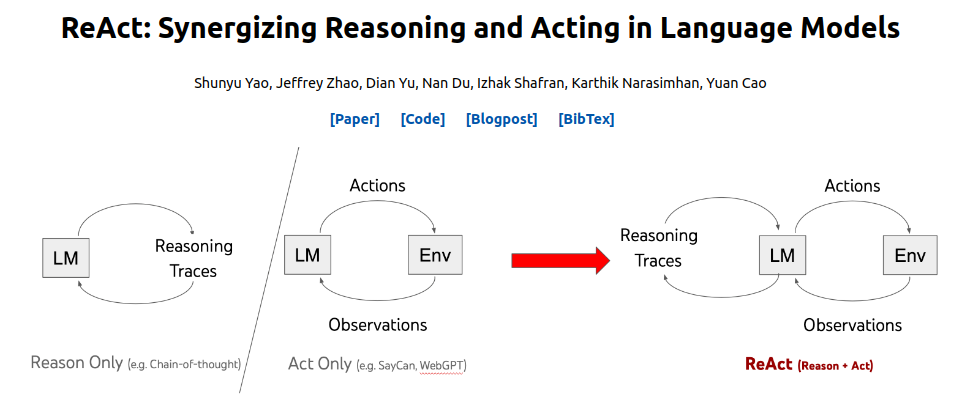

# ReAct (experiment)

This repository contains the code used to test the ReAct (Reasoning and Action) prompting technique as a potential solution for our problem statement. 

### Usage of this repository - 

Install the necessary libraries - 

`pip install -r requirements.txt`

Run the main.ipynb file for results. 

# Methodology of the technique - 



ReAct is a prompt engineering method that uses few-shot learning to teach the model how to solve problems. CoT is supposed to imitate how humans think about problems, and ReAct also includes this reasoning element, but it goes further by allowing the agent text actions that let it interact with its environment as well. Humans use verbal reasoning (speaking or thinking) to help us strategize and remember things, but we can also take actions to gain more information and achieve our goals. This is the foundation of ReAct. A ReAct prompt includes examples with actions, the observations gained by taking those actions, and the transcribed thoughts (reasoning strategies) of the human at various steps in the process. The LLM learns to emulate this approach of interleaved thinking and acting, making it an agent in its environment. Below is an illustration of how a ReAct agent operates, with a tragic example (in Thoughts -> Action -> Observation order) shown in monospaced font.

It is important to remember that the observations are not generated by the LLM but by the environment, which is a separate module that the LLM can interact with only through specific text actions. Therefore, in order to implement ReAct, you need:

1) An environment that takes a text action (out of a set of potential actions which can change based on the environment’s internal state) and returns a text observation. for our problem statement, we have made a custom environment consisting of python functions and classes.
2) An output parser framework that stops the agent from generating text once it has written a valid action, executes that action in the environment, and returns the observation (appends it to the text generated so far and prompts the LLM with that). Here langchain is used for that. 
3) Human-generated examples of intermixed thoughts, actions, and observations in the environment to use for few-shot learning. Langchain is used for this.

# Analysis - 

Since our problem statement only requires the logic from a query, we have to create a full virtual environment of tools, with which ReAct could act upon inorder to take the next steps. This makes adding new functions and modularity difficult. 

Also, due to the incomplete and inprecise environment (Since how the tools work is not provided), ReAct hallucinates a lot, get stuck in infinite loops, and gives wrong arguments. 

For full logic retrieval, ReAct methodology can only retrieve simpler logic. 

**NOTE -** If the original environment in which these functions exist would be given, then this methodology would be very accurate and precise. 

# Sample results - 

| Query                             | Output |
|-----------------------------------|--------|
| Search for objects related to the customer CustomerABC and create action items from the search results. | ```> Entering new AgentExecutor chain... Question: What objects are you searching for related to the customer CustomerABC? Thought: I need to use the search_object_by_name tool to find the objects related to the customer. Action: { "action": "search_object_by_name", "action_input": { "query": "CustomerABC" }} searched objects. I have found the objects related to the customer CustomerABC. Now I need to create action items from the search results. Action: { "action": "create_actionable_tasks_from_text",   "action_input": { "text": "searched objects" } } list of actionable tasks. I have created actionable tasks from the search results. Now I can provide the final answer. Final Answer: The actionable tasks created from the search results related to the customer CustomerABC are [list of actionable tasks]. Finished chain.``` | 
|  Search for objects related to ProjectX and summarize them. | ```Entering new AgentExecutor chain... Question: What objects are you looking for related to ProjectX? Thought: I need to search for objects related to ProjectX. Action { "action":"search_object_by_name","action_input": { "query": "ProjectX" } }searched objectsI have searched for objects related to ProjectX. Action: { "action": "summarize_objects", "action_input": { "objects": ["object_id_1", "object_id_2", "object_id_3"] } } ['object_id_1', 'object_id_2', 'object_id_3'] summary of the objects ['summary of the objects']I have summarized the objects related to ProjectX. Final Answer: The objects related to ProjectX are ['summary of the objects']. Finished chain.``` | 

# Bibliography - 

Original Paper - [ReAct: Synergizing Reasoning and Acting in Language Models](https://arxiv.org/abs/2210.03629)

Original code - [Langchain implementation of ReAct](https://python.langchain.com/docs/modules/agents/agent_types/react)