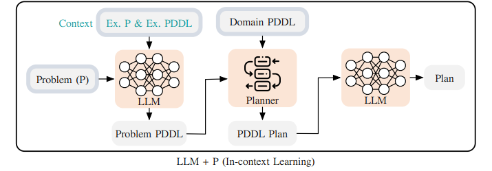

# LLM+P (experiment)

This repository contains the code used to test the LLM+P prompting technique as a potential solution for our problem statement. 

### Usage of this repository - 

Put your openai api key into openai_key.txt. 

Install the necessary libraries - 

`pip install -r requirements.txt`

Run the main.ipynb file for results. 

# Methodology of the technique - 



The planning domain definition language (PDDL) serves as a standardized encoding of classical planning problems. The PDDL representation of a planning problem P is separated into two files: a domain file and a problem file. The domain PDDL file provides a lifted representation of the underlying rules of the world. It includes a set of predicates that define the state space S and the actions (i.e., A ) with their preconditions and effects (i.e., the transition function f). The problem PDDL file provides a list of objects to ground the domain, the problem’s initial state s init and goal conditions S G. There exists a rich set of symbolic planners that implement efficient search algorithms to solve planning problems formalized in PDDL. In this work, we aim to take a natural language prompt which describes the initial states init and goal conditions S G, formulate it in PDDL, and leverage symbolic planners to output correct plans. We assume the domain rules are available.

There are 3 parts in the methodology used - 

### 1) Large Language Model as a PDDL Writer
LLMs are bad at planning (or long-horizon reasoning) but they are good at describing and translating textual inputs, including re-writing planning prompts in the PDDL format. The intuition is that we can view PDDL as a different language than English, so re-writing planning prompts in PDDL is essentially a “machine translation” task that LLMs are known to excel at. Here we provide an example of a
PDDL problem file written by GPT-4 without any promptengineering. As we see, the generated file appears to have the correct PDDL syntax but uses a made-up predicate (empty) and misses the initial condition that b1 is on the table.

### 2) In-Context Learning
LLMs are known to be capable of in-context learning without finetuning their parameters. By in-context learning, we mean LLMs’ ability to perform unseen downstream tasks by simply conditioning on a few input-label pairs (demonstrations). Here is a pair of problem descriptions in natural language and in PDDL provided to GPT-4 as context. When the context is included with the prompt from the example above, the resulting PDDL problem file is directly solvable by the planner.

### 3) Large Language Model + Classical Planner (LLM+P)
Having introduced the LLM’s ability to encode problems in PDDL and in-context learning, we are ready to introduce the proposed LLM+P solution. In particular, we assume that for each problem domain, a human expert can provide a domain description (i.e. action preconditions and effects) that will be fixed for all problem
instances that happen in that domain. While the problem of automatically generating the description is another valuable research question, in this proposed work, we assume that the description is available as a PDDL domain file. The LLM+P method is directly applicable as a natural language interface for giving tasks to robot systems. For instance, assume we want a robot to act as a bartender to make cocktails. It is reasonable to tell it what actions it can take, but leave itself to infer how to make new cocktails most efficiently given a set of ingredients to combine. Moreover, we assume the
agent is provided with a minimal example that demonstrates what an example problem PDDL looks like for a simple problem inside that domain. Next, the agent is provided with a new (potentially quite complicated) problem (P). The LLM then uses the in-context learning to infer the problem PDDL file corresponding to P. Once the problem PDDL file is generated, we feed it into any classical planner, together with the provided domain PDDL file, to generate a PDDL plan. In the end, the LLM translates the PDDL plan back into the natural language to finish up the LLM+P pipeline.

# Analysis -

LLM+P works well for simpler cases of our problem statement, but fails to decipher complex logic, and also fails to decipher logical statements and conditional logic, in the case of bonus points. 

LLM+P method also consumes a lot of tokens (Large language model api calls) for the purpose of our problem statement. 

But, LLM+P is suprisingly good in deciphering accurate logic and due to the PDDL language's logical structure, it never gives inconsistent output. 

# Sample results - 

| Query                             | Output |
|-----------------------------------|--------|
| Summarize issues similar to don:core:dvrv-us-1:devo/0:issue/1 | ```[{'tool_name': 'search_object_by_name', 'arguments': [{'argument_name': 'don:core:dvrv-us-1:devo/0:issue/1', 'argument_value': ''}]}, {'tool_name': 'get_similar_work_items', 'arguments': [{'argument_name': '$$PREV[0]', 'argument_value': ''}]}, {'tool_name': 'summarize_objects', 'arguments': [{'argument_name': '$$PREV[1]', 'argument_value': ''}]}]``` | 
| Summarize high severity tickets from the customer UltimateCustomer | ```[{'tool_name': 'works_list', 'arguments': [{'argument_name': 'ticket.severity', 'argument_value': 'high'}, {'argument_name': 'ticket.rev_org', 'argument_value': 'ultimatecustomer'}, {'argument_name': 'type', 'argument_value': 'ticket'}]}, {'tool_name': 'summarize_objects', 'arguments': [{'argument_name': 'objects', 'argument_value': 'ultimatecustomer'}]}]``` | 
| Given a customer meeting transcript T, create action items and add them to my current sprint | ```[{'tool_name': 'create_actionable_tasks_from_text', 'arguments': [{'argument_name': 'text', 'argument_value': 'T'}]}, {'tool_name': 'get_sprint_id)', 'arguments': []}, {'tool_name': 'add_work_items_to_sprint', 'arguments': [{'argument_name': 'work_ids', 'argument_value': '$$PREV[0]'}, {'argument_name': 'sprint_id', 'argument_value': '$$PREV[1]'}]}]``` | 

# Bibliography

source paper - [LLM+P: Empowering Large Language Models with Optimal Planning Proficiency](https://arxiv.org/pdf/2304.11477.pdf)

source code - [https://github.com/Cranial-XIX/llm-pddl](https://github.com/Cranial-XIX/llm-pddl)