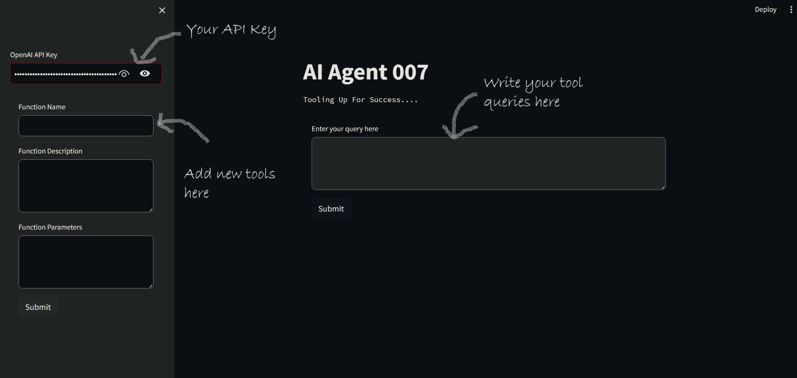
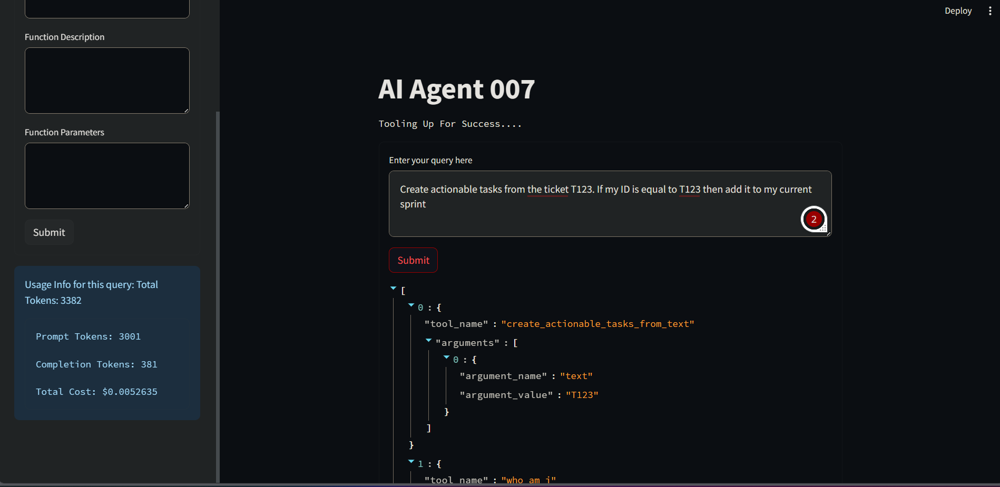
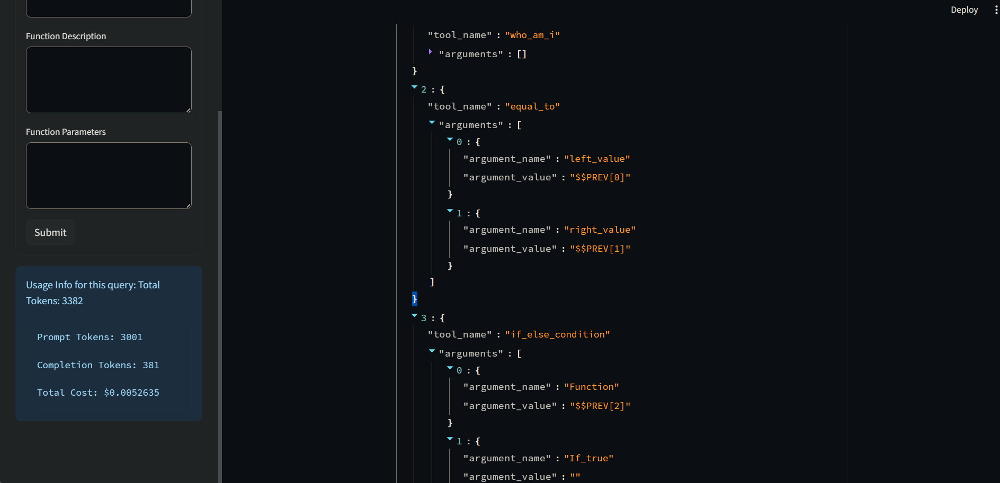
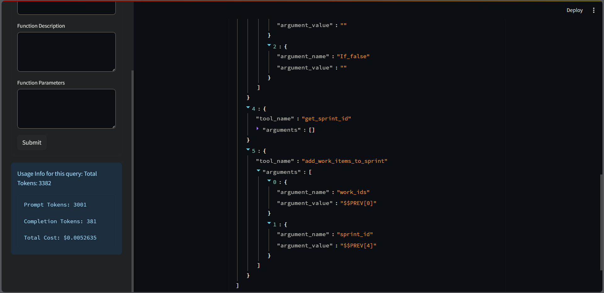

# AI Agent 007 Overview



**AI Agent 007** is a powerful Streamlit application designed to leverage OpenAI's GPT-3 model for answering queries based on a predefined set of functions. The application utilizes the Langchain library, incorporating embeddings and chat models to enhance its capabilities.

## Installation

1. Clone the repository.
2. Install the required dependencies using pip:

    ```bash
    pip install -r requirements.txt
    ```

## Application Composition

The application is structured with a user-friendly interface and robust backend components:

### Framework Requirements

- **Streamlit:** Provides the interactive web interface.
- **json:** Used for handling JSON data.
- **langchain:** Incorporates Langchain library for embeddings and chat models.
- **os:** Handles operating system functionalities.
- **logging:** Implements logging for tracking and debugging.
- **datetime:** Manages date and time-related operations.

### Library Requirements

- **VectorStoreRetriever:** Retrieves functions based on vector embeddings.
- **CustomMultiQueryRetriever:** Utilizes the chat model to break queries into multiple parts.
- **ChainOfThoughtComposer:** Composes answers using a chain of thought approach.
- **devrev_functions:** Predefined functions for initialization.
- **example_queries:** Example queries for testing.

### Usage

1. **OpenAI API Key:** Enter your OpenAI API Key in the sidebar.
2. **Function Addition:** Use the sidebar form to add custom functions.
    - Enter the function name, description, and parameters.
    - Click 'Submit' to add the function.
3. **Chat Interface:** Input queries in the designated text area and click 'Submit'.
4. **Response Display:** View the JSON response and usage information in the main window.

### Application Workflow

1. **Initialization:**
    - The application initializes the Langchain chat model and retriever components.
    - Functions are loaded from the `devrev_functions` dataset.

2. **User Interaction:**
    - Users can add custom functions through the sidebar form.
    - Queries are entered into the chat interface.

3. **Processing:**
    - The application employs the `CustomMultiQueryRetriever` to find functions similar to the query.
    - The `ChainOfThoughtComposer` is then used to generate an answer based on the query and retrieved functions.

4. **Results Display:**
    - The JSON response is displayed in the main window.
    - Usage information, including token counts and cost, is shown in the sidebar.

## Usage Demonstrations

### Query Retrieval





1. Input your query in the designated text area.
2. Click 'Submit' to initiate the query processing.
3. View the JSON response and usage information displayed in the main window and sidebar, respectively.

## Note

Ensure that you have a valid OpenAI API Key to use this application. The key should start with "sk-".